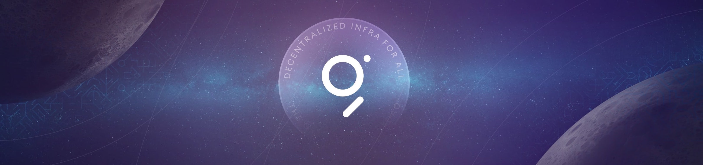

# TheGraph Courses

## What is TheGraph ?

The Graph is a **decentralized indexing protocol** for blockchain datas. It is designed to enable querying on the Ethereum network. TheGraph network also enables developers to build various APIs known as **subgraphs** to customize their data queries.

In this courses you will learn how to create your own Subgraph and how to query blockchain datas with your Subgraph.

## Courses

### Part.1: How to create your own Subgraph and deploy it.

- [Part1.CreateSubgraph.md](./doc/Part1.CreateSubgraph.md)

### Part.2: How to query blockchain datas with a NodeJS App using your Subgraph.

- [Part2.QueryDatas.md](./doc/Part2.QueryDatas.md)

### Part.3: How to deploy your subgraph and your smart-contracts for local development.

- [Part3.LocalDevelopment.md](./doc/Part3.LocalDevelopment.md)
